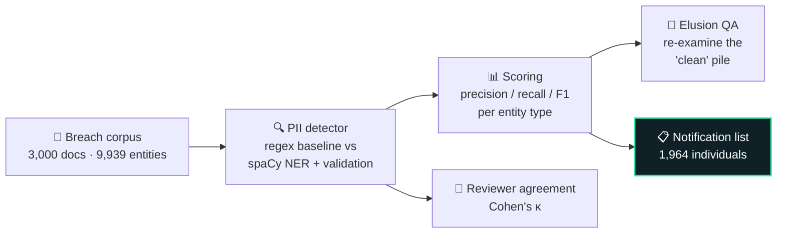
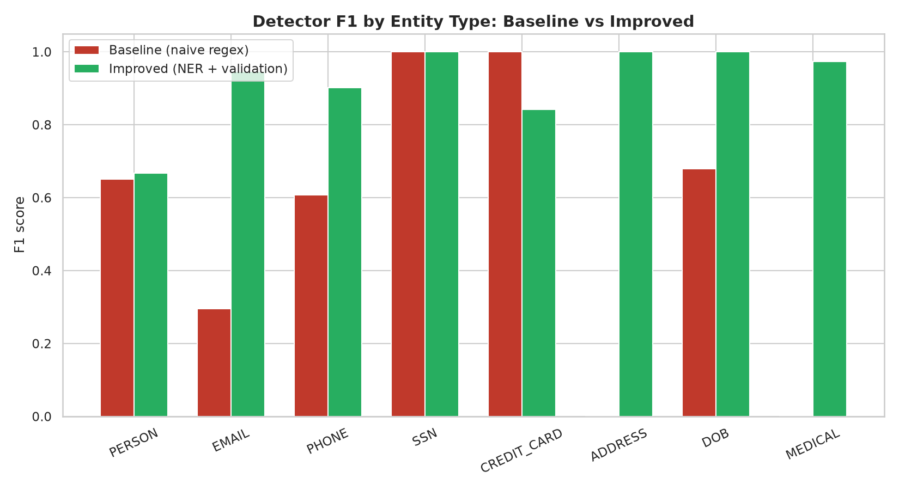
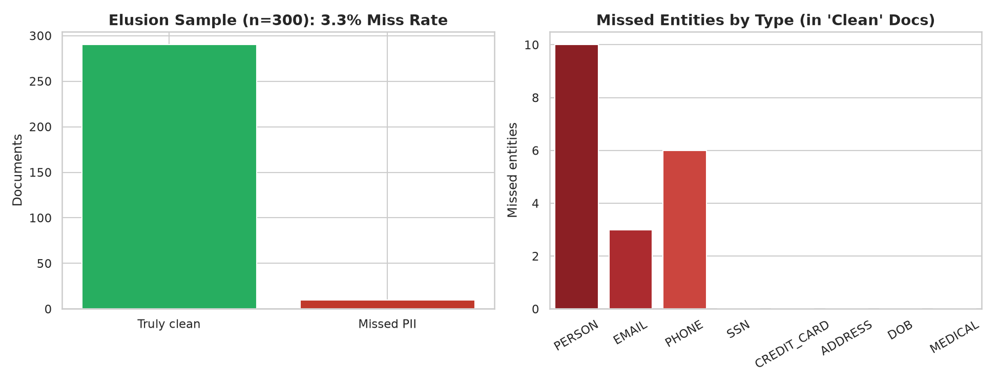
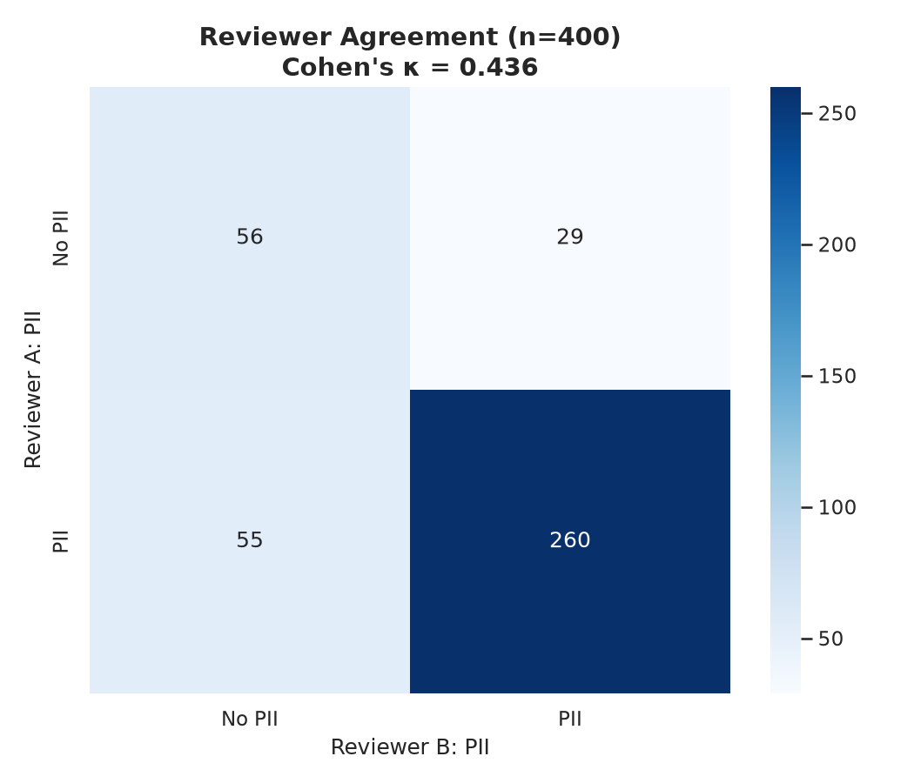

<div align="center">
  
</div>

<p align="center">
  
</p>

<p align="center">
  
  
  
  
  
  
</p>

---

## 🎯 The problem

A company just suffered a data breach. Somewhere in **3,000 recovered documents** — emails, intake forms, medical records, invoices — sits exposed personal data. The legal team needs two things:

1. **A notification list** — exactly who was affected, and what was exposed for each person.
2. **A process that withstands scrutiny** — "it mostly works" is not a defensible position in front of a regulator. Measured error rates are.

This project builds that entire workflow: **detect → measure → QA → notify.**

---

## 🏗️ How it works



**8 entity types detected:** person names, emails, phone numbers, SSNs, credit cards, addresses, dates of birth, medical diagnoses.

---

## 📈 Results — the detector duel

| Metric | Naive regex baseline | Validated detector (spaCy + rules) |
|---|---|---|
| Micro-precision | 0.574 | **0.832** |
| Micro-recall | 0.556 | **0.857** |
| Micro-F1 | 0.565 | **0.844** |

The baseline's failures are the interesting part — it flagged **invoice dates as birth dates**, street names as people, and scored **zero recall on medical diagnoses**. Those are exactly the errors that create liability.

<p align="center">
  
</p>

### 🔬 Quality assurance — measured, not assumed

| Check | Result | Verdict |
|---|---|---|
| **Elusion rate** | 3.3% — 10 of 300 sampled "clean" docs still held PII | Measurable → manageable. Unmeasured → liability. |
| **Reviewer agreement** | Cohen's κ = 0.436 (79% raw agreement) | Human review alone isn't a defensibility strategy — disagreements need adjudication. |
| **Notification list** | 1,964 affected individuals, avg 3.0 exposure types each | 117 PII-bearing docs have no identifiable person → manual triage queue. |

<p align="center">
  
  
</p>

---

## 🧪 Methodology — why this is court-shaped

Every design choice mirrors how high-stakes document review is actually validated:

- **Exact-match scoring** — a detection counts only on a *(document, entity type, normalized value)* match against the ground-truth key. No partial credit, no inflated numbers.
- **Per-entity measurement** — aggregate F1 hides sins; per-type precision/recall exposes *where* the detector fails.
- **Elusion sampling** — the "clean" pile is guilty until proven innocent. Sample it, measure the miss rate, report it.
- **Inter-rater reliability** — human review has error rates too. Kappa quantifies them instead of assuming them away.

---

## 📂 Project structure

```
├── generate_data.py                 # synthetic breach corpus (seed 42)
├── analysis.py                      # full pipeline: detect → score → QA → notify
├── build_notebook.py                # generates the narrated Jupyter notebook
├── Breach_Review_Intelligence.ipynb # 25-cell case-study notebook (9 narrative + 16 code)
├── findings.md                      # 1-page stakeholder executive summary
├── kpi_summary.csv                  # headline numbers (regenerated each run)
├── requirements.txt
├── data/
│   ├── breach_documents.csv         # 3,000 docs: doc_id, doc_type, text
│   └── ground_truth_labels.csv      # 9,939 entities: doc_id, entity_type, value
└── visuals/                         # 7 publication-quality charts
```

---

## ▶️ Run it yourself

```bash
# 1. Install dependencies
pip install -r requirements.txt
python -m spacy download en_core_web_sm   # one-time model download

# 2. Generate the synthetic corpus
python3 generate_data.py

# 3. Run the full pipeline (KPI report in console, 7 charts → visuals/)
python3 analysis.py

# 4. Or open the narrated notebook — reads like a case study, not just code
python3 build_notebook.py
jupyter notebook Breach_Review_Intelligence.ipynb
```

Fully deterministic: wipe `data/`, `visuals/`, and the notebook, rebuild from scratch — every number reproduces exactly.

---

## 💡 What I'd do next

- **Active learning loop** — route low-confidence detections to reviewers, retrain, measure the F1 lift per review-hour (the "agent speed" thesis).
- **Cross-document entity resolution** — link "J. Smith" in email #412 to "Jonathan Smith" in form #88 to deduplicate the notification list.
- **Cost-of-error model** — put a dollar value on false negatives (regulatory exposure) vs false positives (reviewer hours) to pick operating thresholds.

---

## 📝 Data note

The corpus is **fully synthetic** (deterministic, seed 42) — built to mirror real breach-review data shapes, including the distractors (invoice dates, account numbers) that trip naive detectors. Every method transfers directly to live matter data.

<div align="center">
  
</div>
